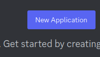

# Discord Bot
<sub>Não fala inglês? [Clique aqui](https://github.com/Robso-creator/discord_bot/blob/main/README.md) para ver esta página em português</sub>

This is a Discord bot project developed in Python that offers a variety of features to enhance the user experience on Discord servers. The bot was created to be flexible, user-friendly, and expandable, allowing customization of commands and integration with other services.

# Table of Contents

* [Generating Required Tokens](#generating-required-tokens)
  * [Creating a Discord Bot Account](#creating-a-discord-bot-account)
  * [Generating NASA API Authentication Token](#generating-nasa-api-authentication-token)
* [Setup & Launch](#setup-&-launch)

# Generating Required Tokens

For the bot to function properly, some tokens need to be provided. Below, you can understand how to generate them.

## Creating a Discord Bot Account
<sub>Step-by-step from [freecodecamp](https://www.freecodecamp.org/portuguese/news/tutorial-de-criacao-de-bot-para-o-discord-em-python/)</sub>

1. Be logged into the [platform](https://discord.com/).
2. Access the [developer portal](https://discord.com/developers/applications).
3. Click on the "New Application" button in the upper right corner:

4. Go to the "Bot" tab and click "Add Bot".
> Keep the default settings for Public Bot (checked) and Require OAuth2 Code Grant (unchecked).
5. Copy the Token; it will be used for bot authentication.

## Generating NASA API Authentication Token

<sub>This token is not mandatory; for testing, the DEMO_KEY is sufficient.</sub>
<sub>With authentication, the API rate limit increases significantly.</sub>

1. Request the [generation of your token](https://api.nasa.gov/) for access to the space agency's API.
2. After filling out the form fields with your name, last name, and email, your token will be sent to the provided email address.
3. Copy the Token; it will be used for NASA API authentication.
> Your token is for personal use and should not be shared.

# Setup & Launch

1. Clone this repository:
```terminal
git clone git@github.com:Robso-creator/discord_bot.git
```

2. `cd` into the new repository:
```terminal
cd discord_bot
```

3. Create a new virtual environment:
```terminal
python -m venv venv
```

4. Activate the new virtual environment:
```terminal
.\venv\Scripts\Activate
```

5. Install dependencies:
```terminal
pip install -r requirements.txt
```

6. Create a `.env` file in the root folder of the project:
```terminal
DISCORD_TOKEN=
NASA_TOKEN=DEMO_KEY
```
7. Run de .py file: <br>
```terminal
python -m main
```