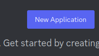

[](https://github.com/pre-commit/pre-commit)


# Bot do Discord
<sub>Don't speak portuguese? [Click here](https://github.com/Robso-creator/discord_bot/blob/main/README-en.md) to view this page in English</sub>

Este é um projeto de bot para Discord desenvolvido em Python
que oferece uma variedade de funcionalidades para
enriquecer a experiência dos usuários em servidores Discord.
O bot foi criado para ser flexível, fácil de usar e expansível,
permitindo a personalização de comandos e integração com outros serviços.

# Sumário

* [Criação de Tokens necessários](#criação-de-tokens-necessários)
  * [Gerar conta de bot no discord](#gerar-conta-de-bot-no-discord)
  * [Gerar token de autenticação API NASA](#gerar-token-de-autenticação-api-nasa)
* [Setup & Launch](#setup-&-launch)

# Criação de Tokens necessários

Para que o bot funcione corretamente alguns tokens precisam ser fornecidos,
a seguir poderá entender como gerá-los

## Gerar conta de bot no discord
<sub>Passo a passo de [freecodecamp](https://www.freecodecamp.org/portuguese/news/tutorial-de-criacao-de-bot-para-o-discord-em-python/)</sub>


1. Esteja logado na [plataforma](https://discord.com/);
2. Acesse a [página de desenvolvedores](https://discord.com/developers/applications);
3. Clique no botão de "Nova Aplicação" no canto superior direito:<br>

4.  Vá até a aba “Bot” e clique em “Add Bot”;
>Mantenha as configurações padrão para Public Bot (marcado) e Require OAuth2 Code Grant (desmarcado).
5. Copie o Token, ele será utilizado para a autenticação do seu bot.<br>

## Gerar token de autenticação API NASA

<sub>Esse token não é obrigatório, para teste somente a DEMO_KEY já é suficiente.</sub>
<sub>Com a autenticação, o limite de batida na API aumenta drasticamente</sub>

1. Primeira coisa a se fazer é solicitar a [geração do seu token](https://api.nasa.gov/) para acesso à API da agência espacial;
2. Após preencher os campos do formulário com seu nome, sobrenome e e-mail, seu token será encaminhado para o endereço de e-mail fornecido;
3. Copie o Token, ele será utilizado para autenticação da API da NASA
> Seu token é para uso pessoal e não deve ser compartilhado

# Setup & Launch

1. Clone esse repositório:<br>
```terminal
git clone git@github.com:Robso-creator/discord_bot.git
```

2. `cd` para o novo repositório: <br>
```terminal
cd discord_bot
```

3. Crie um novo ambiente virtual: <br>
```terminal
python -m venv venv
```
4. Ative o novo ambiente virtual: <br>
```terminal
.\venv\Scripts\Activate
```
5. Instale as dependências: <br>
```terminal
pip install -r requirements.txt
```
6. Crie um arquivo `.env` na sua pasta na pasta `root` do projeto: <br>
```terminal
DISCORD_TOKEN=
NASA_TOKEN=DEMO_KEY
```
7. Execute o arquivo .py: <br>
```terminal
python -m main
```
